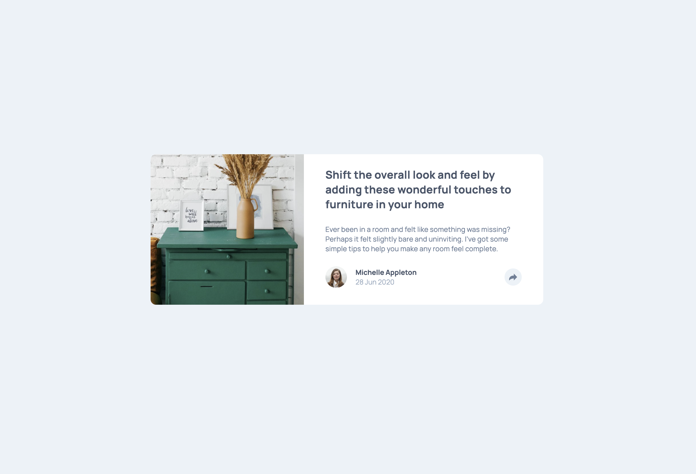
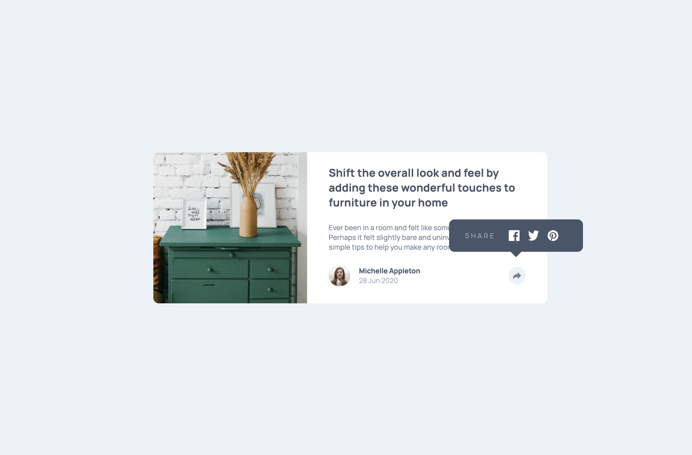

# Frontend Mentor - Article preview component solution

This is a solution to the [Article preview component challenge on Frontend Mentor](https://www.frontendmentor.io/learning-paths/javascript-fundamentals-oR7g6-mTZ-/steps/66d89e853c19191dc32662d7/challenge/start). Frontend Mentor challenges help you improve your coding skills by building realistic projects. 

## Table of contents

- [Overview](#overview)
  - [The challenge](#the-challenge)
  - [Screenshot](#screenshot)
  - [Links](#links)
- [My process](#my-process)
  - [Built with](#built-with)
- [Author](#author)

## Overview

### The challenge

Users should be able to:

- View the optimal layout for the component depending on their device's screen size
- See the social media share links when they click the share icon

### Screenshot

### Links

- [Solution URL](https://www.frontendmentor.io/solutions/responsive-article-preview-with-event-handlers-and-sass-uSPHDKGMEF)
- [Live Site URL](https://petrihcour.github.io/article-preview/)

## My process

### Built with

- Semantic HTML5 markup
- SASS/SCSS
- Flexbox
- Mobile-first workflow

## Author

- [My portfolio](https://vanessafischbach.netlify.app/)
- Frontend Mentor - [@petrihcour](https://www.frontendmentor.io/profile/petrihcour)